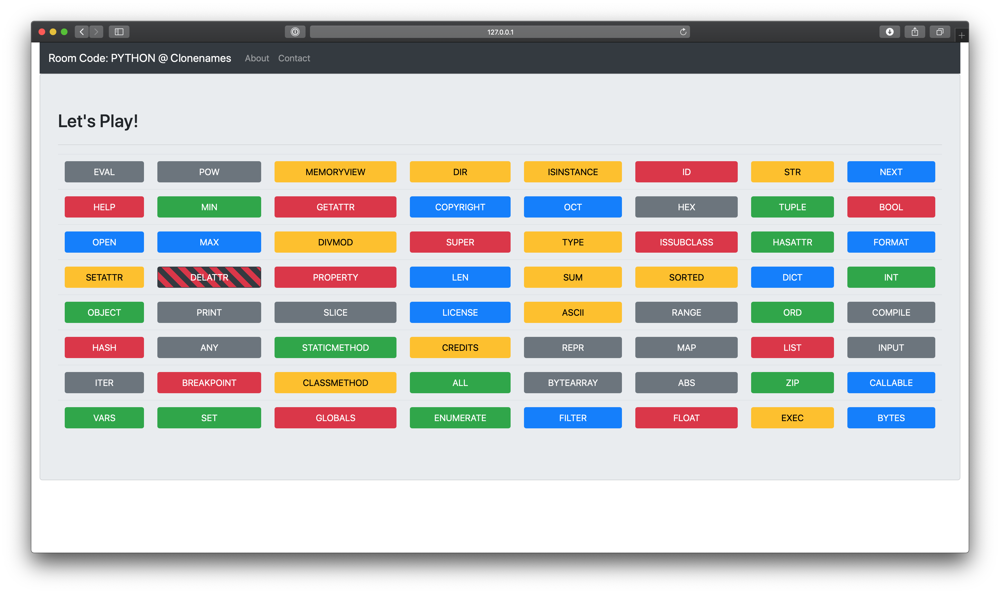

# Clonenames
> Play a Codenames-style game online with anyone you want.

Clonenames is a clone of the game Codenames ([site](https://czechgames.com/en/codenames/), [wiki](https://en.wikipedia.org/wiki/Codenames_\(board_game\))) written in Python using [Flask](http://flask.pocoo.org) and [Socket.IO](https://socket.io/).

Clonenames will let you play across the internet, by connecting to a specific room code, so you can "remotely". The game uses WebSockets to allow the "hosts" to update the screens of the "players".

Unlike the original game, Clonenames allows up to 4 teams, and game boards with up to 100 words (10x10). Additionally, you can play using different word lists for a different challenge! Word lists include:
* The Original Codenames Words
* Cards Against Humanity
* Gen. 1 Pokemon
* PYTHON3 BUILTINS!!!
 
And it's very easy to add any other word lists. They're just new-line delineated files.



## Getting Started
### Prerequisites/Required Libraries
```
flask==1.0.2
flask-socketio==3.2.1
eventlet==0.24.1
```

Clone or download this repository, and install the dependencies.
```
git clone https://github.com/cazier/clonenames.git
cd clonenames
```
If you have/use pipenv, install the dependencies, then start a shell:
```
pipenv install
pipenv shell
```
Or if you don't:
```
pip install -r requirements.txt
```

Then run it with:
```
python web.py
```
### Play!
Open a web browser to [127.0.0.1:5000](127.0.0.1:5000) and you can start a game!

## Gameplay
The rules are very simple. There needs to be one Host and at least one Player for each team. The Host can see which words are theirs based off of color. Then try to get your players to guess your words (and your words only!) with a single clue, and a number of words:
* For example, with a clue like "`typecasting, 4`" I would probably guess `str, int, float, bytes` depending on what's actually visible on the board.

Try to get your team to guess all of the words in your color, without guessing any of the other team's words, or those of the Bystanders. Either will end your turn, and will reveal the color of the other team. Especially, be wary not to guess the Assassin, as that will end the game with your defeat!


## Built With
* [Flask](http://flask.pocoo.org/)
* [Socket.IO](https://socket.io/)
* [Flask-SocketIO](https://flask-socketio.readthedocs.io/en/latest/)
* [Bootstrap](https://getbootstrap.com/)

## Authors
* **Brendan Cazier** - *Initial work*- [cazier](https://github.com/cazier/)

## License
This project is licenesed under the GPLv3 License - See [LICENSE](LICENSE) for more details.

## Acknowledgements
* Obviously Czech Games for the original game idea
* u/professorfart7933 for the suggesting the name "Clonenames"!
